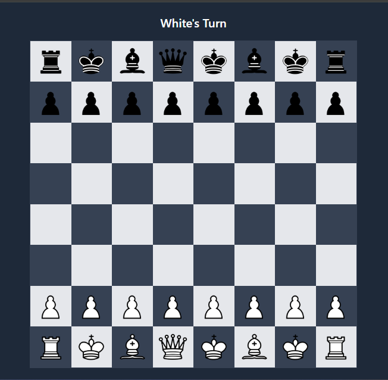

# ♟️ Chess AI Game (React + Vite + Tailwind + chess.js)

This is a web-based Chess game built with React, powered by chess.js, and styled using Tailwind CSS. It features a responsive chessboard where the player plays as White against a basic AI opponent (Black). The AI can be upgraded to a smarter engine later (e.g., Minimax).

📸 Screenshot



## 🔧 Features

- ✅ 8x8 chessboard rendered from chess.js game state
- ✅ Click-to-move with move validation
- ✅ Basic AI that makes random legal moves
- ✅ Visual turn indicator & game status (checkmate, draw, etc.)
- ✅ Piece highlighting & selected square indicator
- ✅ Responsive design using Tailwind CSS
- ✅ Restart game button
- ⏳ Undo & move history (coming soon)


---

## ✅ PROJECT PLAN (Step-by-Step Checklist)

## PROJECT STRUCTURE

```text
/chess-ai
├── public/
│   └── assets/          ← All chess piece images
├── src/
│   ├── components/
│   │   ├── Board.jsx     ← Chessboard grid
│   │   ├── Tile.jsx      ← Each square (with piece if any)
│   ├── ai/
│   │   └── aiEngine.js   ← AI logic (minimax or simpler)
│   ├── utils/
│   │   └── helpers.js    ← Utility functions (e.g., FEN parser)
│   ├── App.jsx           ← Main container
│   ├── main.jsx
│   └── index.css         ← Tailwind + custom styles
├── package.json
└── vite.config.js
```
---
## 🛠 Development Plan

### ✅ PHASE 1: Setup & Board Rendering

- Install Dependencies
- Create Board.jsx
- Create Tile.jsx
- Render pieces from chess.js
- Add click-to-move logic

### ✅ PHASE 2: Chess Logic & AI

 - Validate moves with chess.js
 - Add basic AI that plays randomly
 - Alternate turns

### ✅ PHASE 3: UX & Styling

 - Style board with Tailwind
 - Highlight selected square
 - Show game status (turns, checkmate, draw)
 - Block input after game over

### ⏳ PHASE 4: Extras (Upcoming)

 - Undo move
 - Move history
 - AI difficulty modes (Minimax)
 - Sound effects or animations

## 🚀 Getting Started

### 1. Clone the Repository

```
git clone https://github.com/Nomahk25/chess-ai.git
cd chess-ai
```

### 2. Install Dependencies

```
npm install
```

### Required dependencies:

- chess.js – chess logic & rules
- classnames – for conditional class merging (optional)

```
npm install chess.js classnames
```

## 3. Run Development Server

```
npm run dev
```

Vite will launch your app at http://localhost:5173

## 🧠 AI Logic Notes

Currently, the AI picks a random legal move after each player move. You can later replace this logic with:

- Minimax algorithm
- Alpha-beta pruning
- Stockfish integration via WASM (advanced)

## 📦 Deployment

To build for production:

```
npm run build
```

To preview the production build locally:

```
npm run preview
```

## 🖼 Chess Piece Images

Place all piece images inside:

```
public/assets/
```

Use filenames like:

```
wP.png, wK.png, wQ.png, wB.png, wN.png, wR.png
bP.png, bK.png, bQ.png, bB.png, bN.png, bR.png
```

## 🧑‍💻 Author

Developed by Nomanguni Khumalo
GitHub: [https://github.com/Nomahk25}

📜 License

This project is open-source and available under the MIT License.
